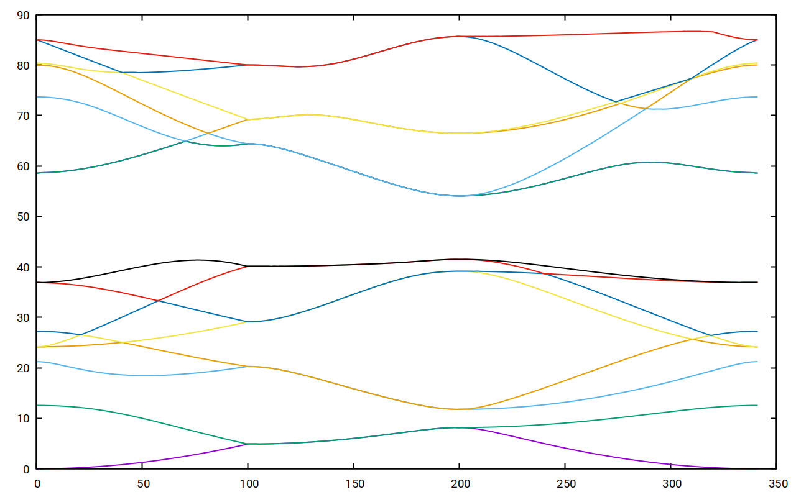

# Maxwell

## Outline
Experimental program for 2D Maxwell eigenvalue problems using
a multigrid-preconditioned inverse iteration

## Objective
We want to compute the smallest non-zero eigenvalues and
corresponding eigenvectors for the magnetic field using Maxwell's
equation with Bloch boundary conditions.
We are looking for band gaps, i.e., gaps between eigenvalues that
never close, no matter what Bloch parameters we choose.

## Methods
To solve sequences of eigenvalue problems, the following techniques
are combined:

- Galerkin discretization using bilinear Nedelec edge elements
- Block preconditioned inverse iteration to compute the
  smallest eigenvalues
- Geometric multigrid with Arnold-Falk-Winther smoother is used
  as a preconditioner
- Geometric multigrid for the Laplace operator is used in the
  gradient space to eliminate the null space
- Ritz-Galerkin techniques are used to solve the projected eigenvalue
  problem in the subspace computed by the inverse iteration
- Rayleigh quotient minimization is used to obtain initial
  guesses for the next Bloch parameter

## Programs
The repository contains a number of test programs for the different
modules, e.g., *test_mgedge2d.c* tests the multigrid iteration for
the space of edge elements.

The main programs are *exp_bloch2d.c*, which computes the smallest
non-zero eigenvalues along a curve in the Brillouin zone, and
*exp_blochsurf.c*, which computes these eigenvalues for the entire
Brillouin zone (and takes much longer).

